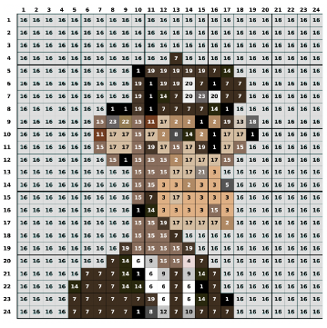
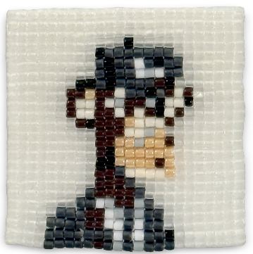

# Pixel Pattern Generator

*A Python application for translating digital images into fabrication-ready patterns for craft media.*

Developed by **Steven Pong**  
School of Industrial Design  
Carleton University
  

## Overview

Pixel Pattern Generator is a Python application that converts digital raster images into printable patterns for physical fabrication using colour-limited materials.

The software was developed to address a common challenge in research-creation and digital craft: translating continuous digital imagery into discrete physical materials while preserving the visual character of the original image. Existing pattern-generation software is often tied to a single manufacturer or craft medium, limiting its flexibility for research and experimentation.

Instead of being limited to a specific manufacturer or craft medium, Pixel Pattern Generator uses a user-defined colour palette supplied as a CSV file. This allows the same computational workflow to be applied to a wide range of materials, including glass seed beads, embroidery floss, mosaic tiles, LEGO, and other pixel-based fabrication systems.

The project originated during the development of *Punked Ape Craft Club*, a research-creation project investigating the translation of digital imagery into handcrafted objects, but is evolving into a generalized computational tool for artists, designers, educators, and researchers.
 
 

## Research Motivation

Many forms of digital fabrication require images to be reconstructed using a limited inventory of physical materials. While digital images may contain millions of colours, physical media often provide only a small, fixed palette.

Pixel Pattern Generator addresses this problem by reducing image resolution and translating every pixel into the closest available material colour supplied by the user.

The result is a fabrication-ready pattern that preserves the overall appearance of the original image while respecting the practical constraints of making.
 
 

## Workflow

1. Import source image(s).

2. Import a user-defined material palette (.csv).

3. Resize the image to the desired output dimensions.

4. Match each pixel to the closest available material colour.

5. Generate fabrication-ready documentation, including patterns, bills of materials, and production estimates.

 

## Example

### Digital-to-Physical Translation

| Original Image | Colour & Resolution Preview | Pattern Output | Finished Artifact |
|:--------------:|:---------------:|:-----------------:|:-----------------:|
|  |  |  |  |

## Features

- User-defined material palettes

- Batch processing of image collections

- Adjustable output resolution

- Perceptual colour matching using CIE L*a*b* colour space

- Aspect-ratio correction

- Printable pattern generation

- Bills of materials

- Pattern legends

- Production estimates

- Collection-wide material summaries
 
 

## Example Material Palette

Material colours are supplied through a simple user-defined CSV file. This allows the software to work with virtually any colour-limited fabrication medium without modification to the source code.

| Name | R | G | B |
|------|--:|--:|--:|
| White | 255 | 255 | 255 |
| Black | 0 | 0 | 0 |
| Red | 212 | 45 | 63 |
| Blue | 41 | 128 | 185 |

The repository includes a deliberately limited six-colour example palette. Replace palette.csv with your own material inventory to generate fabrication patterns for any colour-limited medium.

 

## Highlights

* Implemented in Python
* Modular image-processing pipeline
* User-defined material inventories (CSV)
* CIE Lab* perceptual colour matching
* Automated batch processing of image collections
* Automatic PDF and CSV generation
* Collection-level bill of materials aggregation

 

## Research Context

Pixel Pattern Generator was developed as part of an ongoing program of research examining relationships between digital imagery, computational design, and traditional craft practices.

Although originally developed to support beadwork, the underlying computational framework is applicable to a broad range of research-creation, education, and digital fabrication contexts.
 
 

## Documentation

Installation and usage instructions are available in [INSTALL.md](INSTALL.md).

 

## Feedback

Suggestions, bug reports, and feature requests are welcome. If you use Pixel Pattern Generator in your own research, teaching, or creative practice, I'd be interested to hear about your experience.

## License

This project is licensed under the MIT License. See the `LICENSE` file for details.

